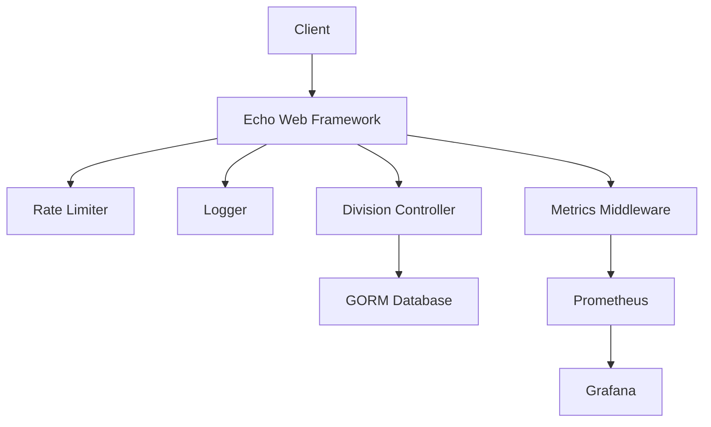
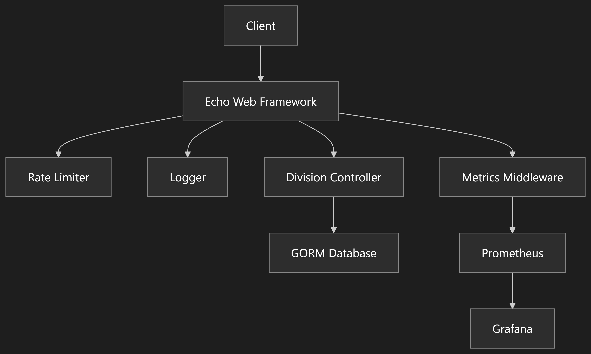

# Codebase Analysis

## 1. Application Overview for new jobs
- Go application using Echo framework
- Provides geographic data API for Bangladesh (divisions, districts, upazilas, unions)
- Uses GORM for database operations
- Structured logging and rate limiting

## 2. Key Components
- Main application (main.go)
- API routes (routes/api.go)
- Division controller (app/http/controllers/DivisionController.go)
- Metrics middleware (middleware/metrics.go)
- Prometheus monitoring
- Grafana visualization

## 3. Architecture

## 4. Deployment
- Containerized using Docker
- Prometheus for metrics collection
- Grafana for visualization
- Custom Prometheus configuration
